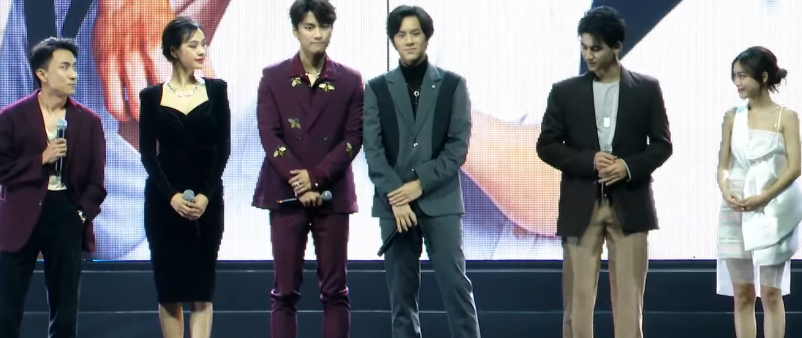
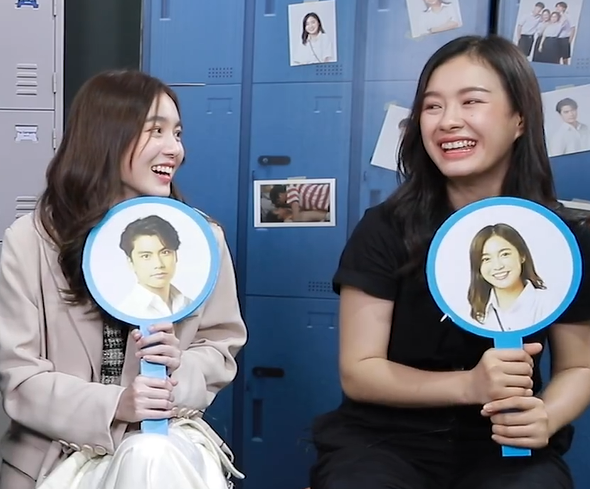
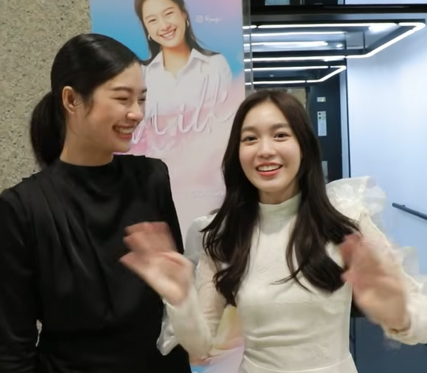
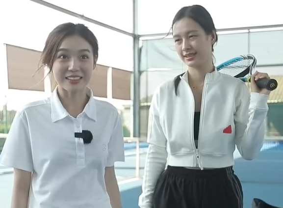
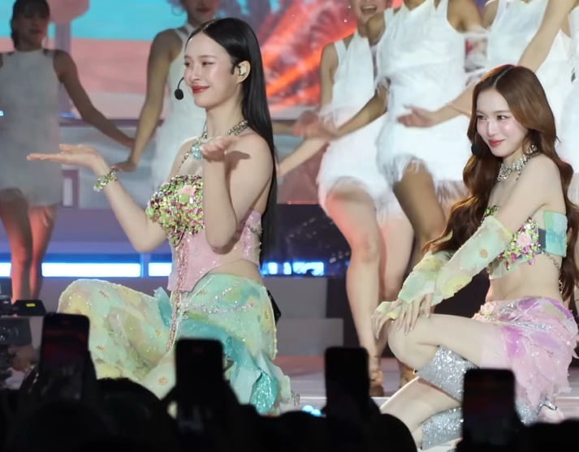
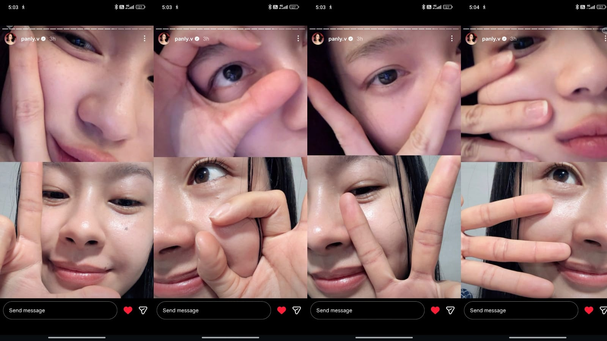
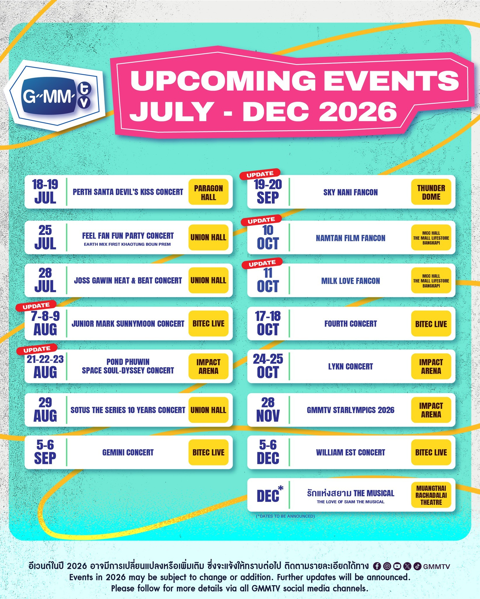
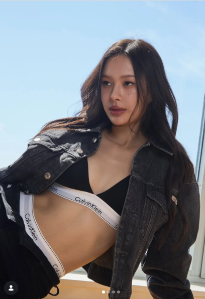
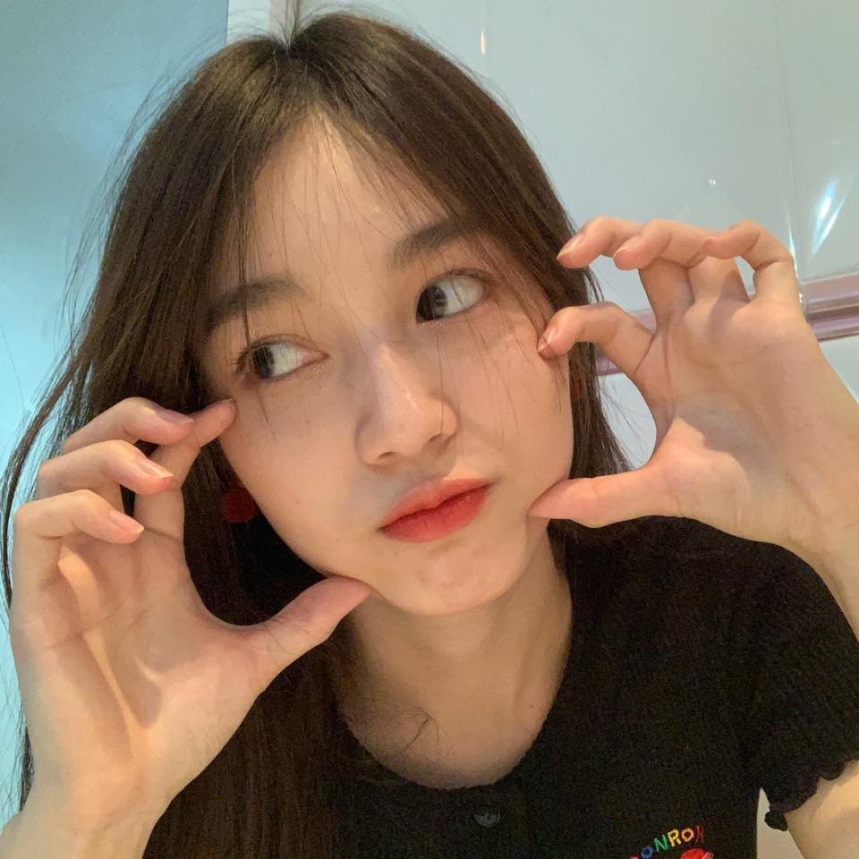

# MilkLove Timeline

Okay, firstly, I haven't been chronically online in the past four-five years as much (college life whack) so I might miss a few stuff but I'll try my best to summarise everything. Please feel free to correct me if I messed up any details. I am going to explain briefly the years (2020-Present) in the following section. Please understand that as fun as shipping is, due to personal moral principles I will not be sharing any timeline details about their personal individual relationship status updates from their fan interactions over the years. However, I will try my best to mention the most talked about topics/ memorable shippable moments in the fandom.

Also if you are an interfan like me, I suggest jump to the useful lingo section first because some of the words otherwise might not make sense.

## Table of Contents

1. [Year 2020](#year-2020)
2. [Year 2021](#year-2021)
3. [Year 2022](#year-2022)
4. [Year 2023](#year-2023)
5. [Year 2024](#year-2024)
6. [Year 2025](#year-2025)
7. [Year 2026 (Running)](#year-2026-running)
8. [Future Projects](#future-projects)
9. [Useful Fandom Lingo](#handy-lingo-for-the-fandom)
10. [Official Socials](#official-socials)
11. [Helpful Fan Socials To Follow](#helpful-accounts)

## Year 2020

MilkLove first met during one of their dance classes within the company building in 2020. At that time, P'Love had recently just starred in 2gether the series and had become very popular. Ohw um P'Love also started 20wendy around then (maybe 2019 but it kind of was officialized in 2020). P'Love had mentioned to P'Aof (director at GMMTV) that she wanted to act in a GL. P'Milk and P'Love were both cast in Bad Buddy the series ([pilot](https://www.youtube.com/watch?v=gSkgpjHoC64) came out in 2020 for [GMMTV 2021 line up](https://www.youtube.com/live/KomVNV7TWXg?si=ryoOXOYJAZ1-KWPX&t=6692)).

 
Bad Buddy Cast in GMMTV2021 Line Up

 If you notice, initially P'Love was cast as Ink (potential love interest for P'Ohm's character ) and P'Milk was cast as Pa (P'Ohm's sister ). Even during the launch you can see P'Milk and P'Love weren't intended as a pair. You can also tell by how they are standing in the cast line up, generally intended couples stand side by side in the line up.
 
 But P'Aof remembered P'Love wanted to act in a GL story so they made InkPa happen. He was also the one who recognised P'Milk suits the character of P'Ink (more husbandly role) more in that case, hence giving birth to MilkLove. I wasn't actively into Thai entertainment then but my younger sister was a big BL fan so she caught me up on this.

## Year 2021

[Bad Buddy](https://mydramalist.com/682589-bad-buddy) was released in like late 2021. Now, back then P'Aof combined with OhmNanon chemistry had made Bad Buddy the biggest BL series of the year. And everyone who watched the show loved MilkLove's chemistry. So much so that despite being a side couple, they were trending on socials with #MilkLove. This was technically before [FreenBecky starred in their first show [SCOY]](https://mydramalist.com/71913-stalker) as a side couple.

This was my introduction to Thai entertainment. My sister initially forced me to watch them in Bad Buddy ( irony😂 ) and I ended up deep diving into Thai entertainment. [Watch this](https://youtu.be/IgRqbuRtNyc?si=_kHNptaiJf6zu5zY) game they played during Bad Buddy promotions in 2021.

 
Bad Buddy Promotions

## Year 2022

Final episodes of Bad Buddy were released in early 2022. So, MilkLove was trending on socials already. Plus, our queen P'Love kept pushing for MilkLove 💖🤲. You can watch their scenes from the Bad Buddy episodes on this [playlist](https://youtube.com/playlist?list=PLtDkaHFD4_FE5l-y2jOWDrJVt5Zt4zWat&si=V4whnIRZMz5wtm3V). 

They appeared in [Magic Of Zero](https://youtu.be/Cw8bKydjDzQ?si=s-aMwJTrI8TaGXOa) (Episodic Main Role) reprising their roles as InkPa. This came out in August 2022. They also briefly appeared in [Vice Versa](https://mydramalist.com/715907-vice-versa) in a guest role, with like 11 seconds of shared space 😂. There's a vloog from P'Milk's youtube channel (girl doesn't post there anymore), you can watch it [here](https://youtu.be/T3oqX0mj7co?si=tJ69Znvm7MeyKT17).

  
   
  Snap from P'Milk's Official Youtube Vlog

Finally [23.5 series was announced in GMMTV's 2023 line up](https://www.youtube.com/live/1Mo_qFTz-qY?si=eDFT0arRiSVz9W6z&t=3587) in November 2022. This is the initial pilot for 23.5, the concept was kind of polished and improved later on. But GMMTV kind of messed up the timing due some last minute cast changes in middle of shooting (in like middle of 2023).

MilkLove and FreenBecky both caught public attention from their appearance as side couples in a BL around the same time, actually MilkLove appeared onscreen first. Yet 23.5 was released in March 2024 despite being shown on 2023 lineup. 

Back then MilkLove were then termed as the "8 second couple" because of their short scenes together. Where GMMTV was unfortunately lagging, IdolFactory seized the opportunity fast (it was probably easier for them too since they were a newer company but GMMTV as a bigger company had to weigh in a lot of factors).

## Year 2023

 The shooting of 23.5 Series took place this year. Public speculation states that the company basically was waiting to see the public response for GAP. GAP's commercial success kind of reassured the company that it is worth a shot. Thankfully our girls also kept wanting to work with each other. Plus, the OG muvmuvs were very dedicated and loyal. There's a vlog from P'Love's official youtube account from around March 2023, you can watch it [here](https://youtu.be/XVD8PwlzRtc?si=WrOk9hEPhajXz2nd).

  
   
  Snap from P'Love's Official Youtube Account Vlog

 23.5 was a big deal for GMMTV since they had never done GLs and GMMTV is a big entertainment company so once they produce it, it's going everywhere (like it was the first Thai GL that went to premiere on Netflix). But official statement wise, the delay happened because GeminiFourth (one of the GMMTV BL ships) who were cast in 23.5 as a side couple could not participate in filming anymore as they had to prepare for their own new series. So, the schedule got delayed. Filming was finished in November 2023. 
 
 There a few clips on the internet from them of P'Milk and P'Love being teased by other costars/friends in GMMTV during different lives/shoots (possibly because they were clearly going to be the first female Confirmed Pair of the company). 

## Year 2024

[Official 23.5 Trailer](https://youtu.be/mdOlxH11WnQ?si=Z4calfL2O-ZqJ92J) was released in February. The series finally started airing in March, that too on International Women's Day (lessssgooooo). This paved the way for GLs in GMMTV, you can watch it on GMMTV's official Youtube Channel [here](https://youtube.com/playlist?list=PLszepnkojZI7DbooKGnHIy2Zz7BF4fqr-&si=IyHz7A8C6RV3WN71) (given that it isn't geoblocked for you). It is also available on Netflix so do check there. It was successful surely but the fact that MilkLove were right up there with FreenBecky in starting the ThaiGL wave, a lot of the new fan didn't get to know that unfortunately. [Muvmuv](#muvmuv-the-mascot) was also born this year on May 24 (a day after P'Love's birthday lol). You can watch them create Muvmuv [here](https://www.youtube.com/watch?v=qG8WquuErt8).

  
   
  MilkLove in GMMTV2024 Outing

Back then, besides FreenBecky, EngLot and AndaLookkaew were the only GL ships who have had their own show. Later that year, LingOrm's first show TSOU, FayeYoko's Blank, LMSY's Affair and NamtanFilm's Pluto were released. 

MilkLove weren't big on fan service and they have always maintained that very religiously. There are a lot of clips and memes within the fandom from this time about P'Love going "Ya Jin" (meaning don't ship) and she even bought rubber bands to a fan event to keep the delulu fans in check 😂. 

During this era, some fans complained about the lack of chemistry between MilkLove (they were literally portraying high school kids where on-screen intimacy had to be limited and MilkLove aren't big on fanservice🤦🏻‍♂️). 

In late 2024, MilkLove (well it didn't stay a secret because one of them accidentally revealed they were together through their posts) went on a 9 day South Korea tour. This is often referred to within the fandom as the SK tour. P'Milk eventually shared a vlog on her [Tiktok](https://vt.tiktok.com/ZS9QMHc2R/), you can watch that full vido with English translation [here](https://www.youtube.com/watch?v=KcXPGYPA9rM) on Youtube. It was initially supposed to be a friends tour (from the 23.5 cast) with more friends going with them but their schedules didn't line up. Some even claimed that apparently this trip was sponsored by the blue company to do damage control 😂(which have you seen the budget they provide for promotions???? ye no).

In GMMTV 2025 lineup, they announced [WhaleStoreXoXo](https://www.youtube.com/live/057lFJnjqi0?si=Af5s_oP2HZTUXJc-&t=4512) and [Girl Rules](https://www.youtube.com/live/057lFJnjqi0?si=8FewCd0HhABJ0kza&t=9284). You will also find some cute moments from Starlympics24 (an GMMTV annual star sports event) on different social media (mainly the one where [P'Milk lifted P'Love up in a hug](https://www.youtube.com/watch?v=PJX4_JxqBe8) after her race). There are a lot more moments, you can watch compilations of them on youtube.

## Year 2025

WhaleStoreXoXo was shot in the first half and released about in the middle of the year. You can watch it on [here](https://youtube.com/playlist?list=PLszepnkojZI4qpSumzOHRdNa79JRiC-cE&si=13aKot3iDQVTQXPr) (again given that's it not geo blocked for you). It created new records for the company, being a massive success. P'Milk had appeared for Paris Fashion Week at YSL's Fall/Winter Show in March and our number one Mimiv was so proud of her ([as you can see](https://x.com/sapphoria_th/status/1900403112432865566)).

Shooting for Girl Rules started after WSX was done airing. While new Muvs might not be able to tell, during this time a significant shift was seen in MilkLove chemistry which is kind of widely accepted within the fandom. Some refer to the 2024 SK trip as the "initial" point of the shift and some refer to [this interview ](https://youtu.be/LQ4EfMzXgq4?si=iem94X1uXJMPUxBM)as the "initial" point. 

Basically after the presumed shift, they seemed to be more comfortable with each other (which to be fair they have been on-screen partners for years by that point so kinda expected) and P'Love had stopped calling out shippers 😂🫰. Also I personally think [this praewmag interview ](https://youtu.be/yuz_r8hnUhw?si=frZvXVNe0qvnMjuA) helped fans better understand MilkLove around this time. 

P'Milk had surprised P'Love with a branded T shirt for her bday (she had to make up excuses to go shopping and ended up gifting early because she was worried P'Love might get upset about her weird sudden detachment). P'Love had gifted P'Milk a YSL sunglass for her birthday.

 This year was also the first [BlushBlossom FanFest](https://www.youtube.com/watch?v=hvDOZG1V1Fg) starring MilkLove, NamtanFilm, EmiBonnie, ViewMim and JuneMewnich. You will find a ton of fancams on Youtube for BlushBossom. 

  
   
  MilkLove in BlushBlossomFanFest2025 in Macau

 
 Ditto the Series was announced for [GMMTV's 2026 line up](https://www.youtube.com/live/JGhHa5dGzGc?si=et0Wmw_p3sKOxOLR) with MilkLove as the lead. GMMTV announced a total of 8 GLs in their 2026 lineup and you will notice old muvs often thank P'Love for that because it was on her insistence that GMMTV explored GL.
 
 During Starlympics25, P'Love literally did what she had spoken of in a previous live show. She had said that she was so excited during starlympic that if she could, she would run along P'Milk to cheer her up. So, P'Love literally ran alongside P'Milk on the track to cheer her up (there's a ton of edits on this on the internet from every possible angle 👀 [here's one](https://youtube.com/shorts/lTHClxz5EWs?si=SpnWzFPgMppL1MQt)). 
 
 Also P'Jang became MilkLove's manager in 2025, previously it was P'Jojo. 

## Year 2026 *(Running)*

Firstly, P'Milk became YSL BA in like January (go girllll!). The Girl Rules shooting was finished and [official trailer](https://youtu.be/lDUD3omAlHA?si=Ro9E0VsoKPyagDVK) was released in Februrary. It started airing in March. During January and February this year P'Milk and P'Love had a lot of events back to back. P'Milk besides her fashion work and work with P'Love is also shooting for Scarlet Heart while P'Love is working on [20wendy](https://www.instagram.com/twentywendy/) her makeup brand and her new clothing brand [yoonighty](https://www.instagram.com/yoonighty).

 During valentine's day this year, P'Milk was away for a fashion event but had posted "L O V E" spelled out through video call between her and P'Love on her story. 

You will find countless edits from their interviews reactions and fan interactions from GR promotion and airing era online. If GR is available on youtube for you, you can watch it [here](https://youtube.com/playlist?list=PLo8dqgdBbe4V4nlNTvR4YV49SYxpDjtiP&si=xTi9qj9kn66t1jM-). It is also available on iQIYI for some of you. 

Girl Rules finished airing in the first week of June. Then [Blush Blossom Fan Fest 2026](https://www.youtube.com/watch?v=XrObJGT_1Co&list=RDXrObJGT_1Co&start_radio=1) took place in the middle of June, where MilkLove performced on two couple songs : [Next Love](https://www.youtube.com/watch?v=SPrBDyFnsDM) and [ไว้ใจได้กา](https://www.youtube.com/watch?v=g20V6m391TY). While the Next Love was way too steamy for muv's fragile hearts, the fandom fondly called ไว้ใจได้กา their wedding performance. 

  
   
  MilkLove BlushBlossom Fan Fest in 2026

Currently, Snap25 team is working on finding the locations for the series, outfits trials have been done. We have our Dear and Rafah:

  
   
  Milk Pansa Vosbein as Dear (from fittings pictures shared by <a href="https://x.com/DittoSeries">Official Ditto X account</a>)

  
   
  Love Pattranite Limpatiyakorn as Rafah (from fittings pictures shared by <a href="https://x.com/DittoSeries">Official Ditto X account</a>)

## Future Projects

We finally have a FanCon!!!! GMMTV has announced a MilkLove FanCon for November (well they initially said October and then updated that in middle of July).

  
   
 MilkLove Upcoming FanCon Date Updated

## Handy Lingo for the fandom

These are basically words/abbreviatons, used within the fandom a lot. Some of them literally are just basic thai lessons at this point 😂.

- 💚-> P'Milk

- 💖-> P'Love (also sometimes referred to with just the 🩷 pink heart)

- P' -> Phi (used to address seniors in Thai culture, it's gender neutral)

- N' -> Nong (used to address juniors in Thai culture, it is also gender neutral)

- K' -> Khun (used to address people formally, like Mr/Ms but it's also gender neutral)

- Muvmuv -> M from Milk, uv from Luv (ML fans, also the Mascot considered as MilkLove's daughter and is represented by an orange heart 🧡) [See Picture](#muvmuv-the-mascot)

- Mini heart -> P'Love fans

- Mimiv -> P'Milk fans
- q0 basically refers to the number one fan/number one in line to be their partner.

- P'Pat -> P'Love (cool vibe, also Love Pattranite)

- Green Flag Forest -> P'Milk (once you have been in the fandom for long enough you will see P'Milk really is such a green flag of a woman)

- Orange Cat -> P'Love (I personally don't know who came up with this but I think it is because of her orange cat energy at times)

- Samoyed -> P'Milk (Again I don't know who came up with this but I think it is because of the fact that P'Milk really does give off samoyed puppy vibes at times)

- Uke -> Bottom & Seme -> Top (borrowed from Japanese culture I believe). P'Love is a muscle uke (according to a seme/uke [online quiz](https://ukeorsemequiz.com/en) result she shared sometime in March/April 2026). We don't know what type of Seme P'Milk is but we know she is one.

- MCU -> MilkLove Cinematic Universe (basically referring to their work as an onscreen pair in different series)

- GreenPink -> Referring to the muvmuv fandom (MilkLove's heart colors)

- Lawr (r is kinda silent) -> Handsome
- Suay -> Beautiful 
- Lolen -> Joking
- MLPFK -> MilkLove Pen Faen Kan (trans. Milk/Love are Dating), it's a shipper made thing. People have fun with the hashtag, don't take it seriously. 
- GR -> Girl Rules Series
- WSX -> Whale Store XoXo Series
- Ditto -> Ditto Series
- BBS -> Bad Buddy Series
- alai / arai -> what
- kham mai -> why
- ya jin -> Don't ship (Don't be delulu 😂). For the longest time P'Milk and specially P'Love made sure to remind us to not ship too hard, since sometimes fans get way to carried away in shipping and end up feeling hurt when their ship doesn't sail. Basically they didn't want us to ship too hard and hurt (our green flag girlies).
- yak jin -> Want to ship. P'Love's famous dialogue in fan events😂. Instead of idol giving fan service, it's P'Love on the look out for couples in her event for fan service from the fans 😂. She even has a habit of matchmaking muvmuvs at fan evens/interactions.
- tooth warm -> P'Milk (because of Shasha from Girl Rules in ep3)
- baby sting ray -> P'Milk (because P'Love thought she looks like one in [this](https://x.com/i/status/2054446698374807876)).

## Less relevant, random info dump 

- P'Milk has both elder and younger siblings. Some of her siblings live abroad (USA and SK I believe). She's from the north (Northern Thai dialect had an accent). She dreams of opening a cafe someday.

- P'Love is the eldest daughter with one sister and one brother. She was born and brought up in Bangkok. She's sponsoring her siblings'education and wants to help her mom and dad retire early. 

- P'Milk was born in 1996 and P'Love was born in 2000. Sometimes this is referred to as the 9600 couples (since NamtanFilm also have the same age gap).

## Official Socials
### Milk Pansa Vosbein

 
Milk Pansa Vosbein

Our P'Milk aka P'Mew!!! To be fair you probably wouldn't have been on this page if you didn't already follow her 😂. But in case you missed out some, here's all her socials for you.

 

[Youtube](https://www.youtube.com/@panly7833) &ensp;|&ensp; [X](https://x.com/panlyyy) &ensp;|&ensp; [Instagram](https://www.instagram.com/panly.v) &ensp;|&ensp; [Tiktok](https://www.tiktok.com/@panly.v)

### Love Pattranite Limpatiyakorn

 
Love Pattranite Limpatiyakorn

Our P'Love/Luv aka P'Loverrukk/Luvrrukk (Ruk means love in Thai). As the first born child, her parents affectionately nicknamed her love and it definitely suits our girl! 

 

[Youtube](https://www.youtube.com/@loverrukkpattranite7774) &ensp;|&ensp; [X](https://x.com/loverrukk) &ensp;|&ensp; [Instagram](https://www.instagram.com/loverrukk) &ensp;|&ensp; [Tiktok](https://www.tiktok.com/@luvrrukk) &ensp;|&ensp; [Facebook](https://www.facebook.com/loverrukkchannel)

### GMMTV

 
GMMTV Logo

GMMTV is a TV production and talent agent company under GMM Grammy (a Thai entertainment conglomerate). Basically in Thai entertainment industry, you will often see stars/idols are managed by certain talent agencies. MilkLove are under GMMTV contract currently. 

 

[Youtube](https://www.youtube.com/@gmmtv) &ensp;|&ensp; [X](https://x.com/GMMTV) &ensp;|&ensp; [Instagram](https://www.instagram.com/gmmtv/?hl=en) &ensp;|&ensp; [Tiktok](https://www.tiktok.com/@gmmtvofficial)

### MuvMuv the Mascot

 
MuvMuv

The character (a white samoyed dog) wears an orange cat head scarf referencing to P'Love's nickname and branding also arries a box of pink milk, a referencing  to P'Milk.

**Fun Fact:** Every time Muvmuv appears for an event, MilkLove actually get a portion of the pay. It's a GMMTV rule, where mascot's parents get paid too when the mascot appears at an event. It is there so that the relation between the actors and the mascot can be nurtured more easily. Following are MuvMuv's socials:

[Instagram](https://www.instagram.com/muvmuv.gmmtv/) &ensp;|&ensp; [X](https://x.com/muvmuv_GMMTV) &ensp;|&ensp; [Tiktok](https://www.tiktok.com/@muvmuv.gmmtv)

## Helpful Accounts

Now, before I start. There are a lot moreeeeeee and I kinda am not as chronically online so I will keep adding more to the list as we go I suppose. 

[P'Jang](https://x.com/Jangthanyalux): Meet P'Jang! She is P'Milk and P'Love's manager. Fun fact, she is also ViewMim's manager. Follow her for behind the scene random lores.

[P'Sapphoria Account](https://x.com/sapphoria_th): First and foremost we have P'Sapphoria! She does an amazing job translating MilkLove moments and content. So, specially for interfans, she's a lifeline. Also follow, if you want to watch P'Love ship her and her girlfriend 😂. 

[P'Baymax](https://x.com/bodyguardchuu): Someday I am going to earn a lot of money and pay back Phi for all the money they spent for the fandom going to events 😂. Thanks phi for sharing all the cutesy interactions!

[MilkLove Offical Fan Account](https://x.com/MilkLoveTH): You will get all your MilkLove event updates here. The admins do an amazing job of keeping up with their schedules so we don't have to, thank youuu!

[Official P'Milk Fan Club](https://x.com/milkfamily_): You will get all your P'Milk event updates here. But obviously they are one of the biggest muvmuvs too so they end up sharing a lot of MilkLove stuff too XD.

[Official P'Love Fan Club](https://x.com/LoveOfficialTH) / [Backup](https://x.com/LoveOfficialTH2): You will get all your P'Love event updates here. Similarly to P'Milk's fan club, they are also one of the biggest muvmuvs out there. 

